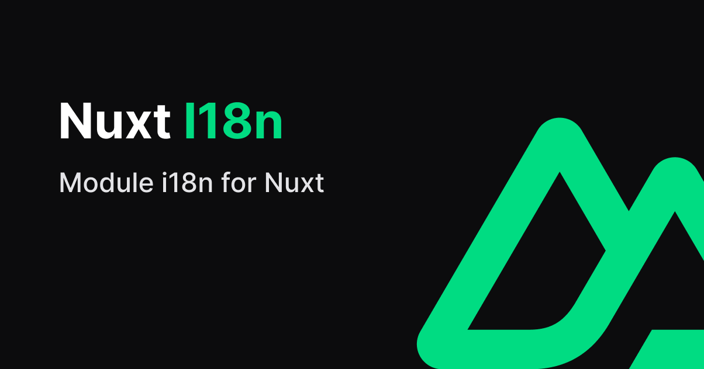

[](https://i18n.nuxtjs.org)

[](https://npmjs.com/package/%40nuxtjs%2Fi18n)
[](https://npmjs.com/package/%40nuxtjs%2Fi18n)
[](https://npmjs.com/package/%40nuxtjs%2Fi18n)
[](https://snyk.io/test/github/nuxt-modules/i18n)
<a href="https://volta.net/nuxt-modules/i18n?utm_source=nuxt_i18n_readme"></a>

# Nuxt I18n

> I18n module for Nuxt

The i18n module for Nuxt 3

## ✅ Status: v8

If you would like to use the stable version for Nuxt 2, please see the [`v7` branch](https://github.com/nuxt-modules/i18n/tree/v7)

## 🚀 Usage

### Install

1. Add the following line to the `devDependencies` with your package manager:

```sh
npx nuxi@latest module add i18n
```

2. Add `@nuxtjs/i18n` to the `modules` section of `nuxt.config.ts`

```ts
{
  modules: [
    '@nuxtjs/i18n',
  ],
}
```

## Edge Release Channel

We provide [the Edge Release Channel nuxt i18n module, like Nuxt3](https://nuxt.com/docs/guide/going-further/edge-channel#edge-release-channel)

Nuxt i18n module is undergoing commits, improvements and bug fixes. You can opt-in to be the first to test it before the next release.

### Opting Into the Edge Channel

Update nuxt i18n module dependency inside `package.json`:

```diff
{
  "devDependencies": {
--    "@nuxtjs/i18n": "^8.0.0"
++    "@nuxtjs/i18n": "npm:@nuxtjs/i18n-edge"
  }
}
```

Remove lockfile (`package-lock.json`, `yarn.lock`, or `pnpm-lock.yaml`) and reinstall dependencies.

### Opting Out From the Edge Channel

Update nuxt i18n module dependency inside `package.json`:

```diff
{
  "devDependencies": {
--    "@nuxtjs/i18n": "npm:@nuxtjs/i18n-edge"
++    "@nuxtjs/i18n": "^8.0.0"
  }
}
```

## 📖 Documentation

[Read more v8 documentation](https://i18n.nuxtjs.org/).

Keep in mind that not all features are currently supported yet and some things might be broken.

## 🔗 Links

- 📘 [Documentation for v8](https://i18n.nuxtjs.org/)
- 📘 [Documentation for v7](https://i18n.nuxtjs.org/docs/v7)
- 🔖 [Release notes](./CHANGELOG.md)
- 👥 [Community](https://discord.nuxtjs.org/) (`#i18n` channel)

## ©️ License

[MIT License](./LICENSE) - Copyright (c) Nuxt Community
