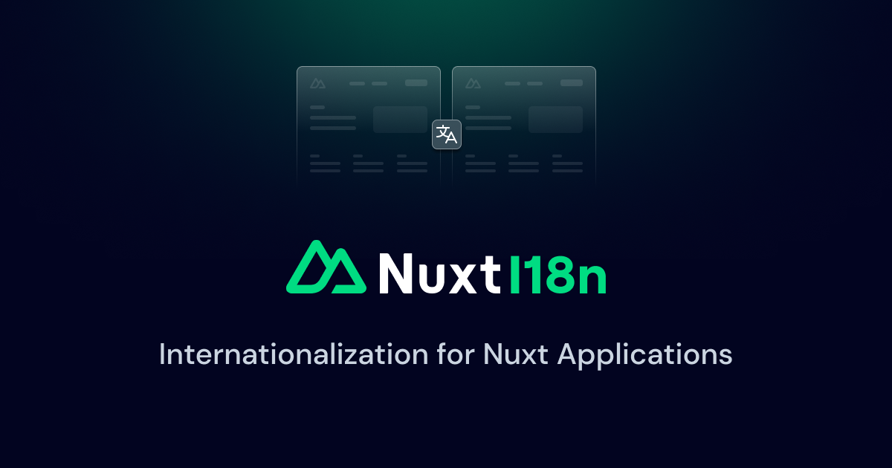

<p align="center">
  
</p>

[](https://npmjs.com/package/%40nuxtjs%2Fi18n)
[](https://npmjs.com/package/%40nuxtjs%2Fi18n)
[](https://npmjs.com/package/%40nuxtjs%2Fi18n)
[](https://snyk.io/test/github/nuxt-modules/i18n)
<a href="https://volta.net/nuxt-modules/i18n?utm_source=nuxt_i18n_readme"></a>

# Nuxt I18n

> I18n module for Nuxt

The next i18n module for Nuxt 3

## ✅ Status: v8 beta

If you would like to use the stable version for Nuxt 2, please see the [`main` branch](https://github.com/nuxt-modules/i18n/tree/main)

## 🚀 Usage

### Install with `next` tag

1. Add the following line to the `devDependencies` wiht package manager:

```sh
# Using npm
npm install @nuxtjs/i18n@next --save-dev

# Using yarn
yarn add --dev @nuxtjs/i18n@next

# Using pnpm 
pnpm install --shamefully-hoist -D @nuxtjs/i18n@next
```

2. Add `@nuxtjs/i18n` to the `modules` section of `nuxt.config.ts`

```ts
{
  modules: [
    '@nuxtjs/i18n',
  ],
}
```

### Install edge version

1. Add the following line to the `devDependencies` in `package.json`:

```json
"@nuxtjs/i18n": "npm:@nuxtjs/i18n-edge"
```

2. Run `npm install` or `yarn` or `pnpm install --shamefully-hoist`.

3. Add `@nuxtjs/i18n` to the `modules` section of `nuxt.config.ts`

```ts
{
  modules: [
    '@nuxtjs/i18n',
  ],
}
```

## 📖 Documentation

[Read more v8 documentation](https://v8.i18n.nuxtjs.org/).

Keep in mind that not all features are supported yet and some things might be broken.

## 🔗 Links
- 📘 [Documentation for v8](https://v8.i18n.nuxtjs.org/)
- 📘 [Documentation for v7](https://i18n.nuxtjs.org/)
- 🔖 [Release notes](./CHANGELOG.md)
- 👥 [Community](https://discord.nuxtjs.org/) (`#i18n` channel)

## ©️ License

[MIT License](./LICENSE) - Copyright (c) Nuxt Community
